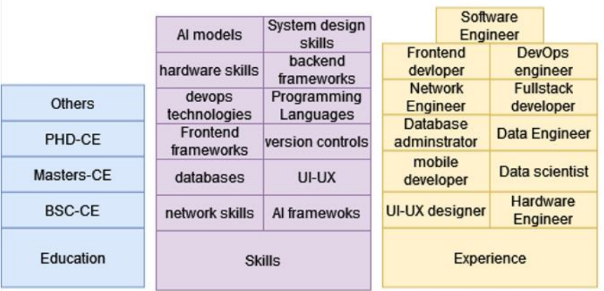
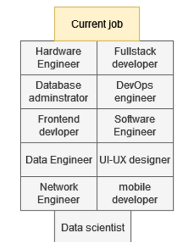

# model

The figure below shows the structure of the model.

    
    <caption>Model structure</caption>

For each model, we need dataframe and the data has input and also output part.
The input dataframe structure is shown below.

    
    <caption>Input dataframe structure</caption>

Also the output dataframe structure is shown below.

    
    <caption>Output dataframe structure</caption>

## Models Used
Three models were used in this project which are:
- Decision Tree Classifier
- Gradient Boosting Classifier
- XGBoost Classifier

For Decision Tree Classifier, the accuracy stood on **74.7%**
The Graident Boosting and XGBoost Classifier both had the same accuracy which was **78.5%**. It was the best accuracy among these three models.
More details about the models and results can be found in the [notebook](models/all.ipynb)
